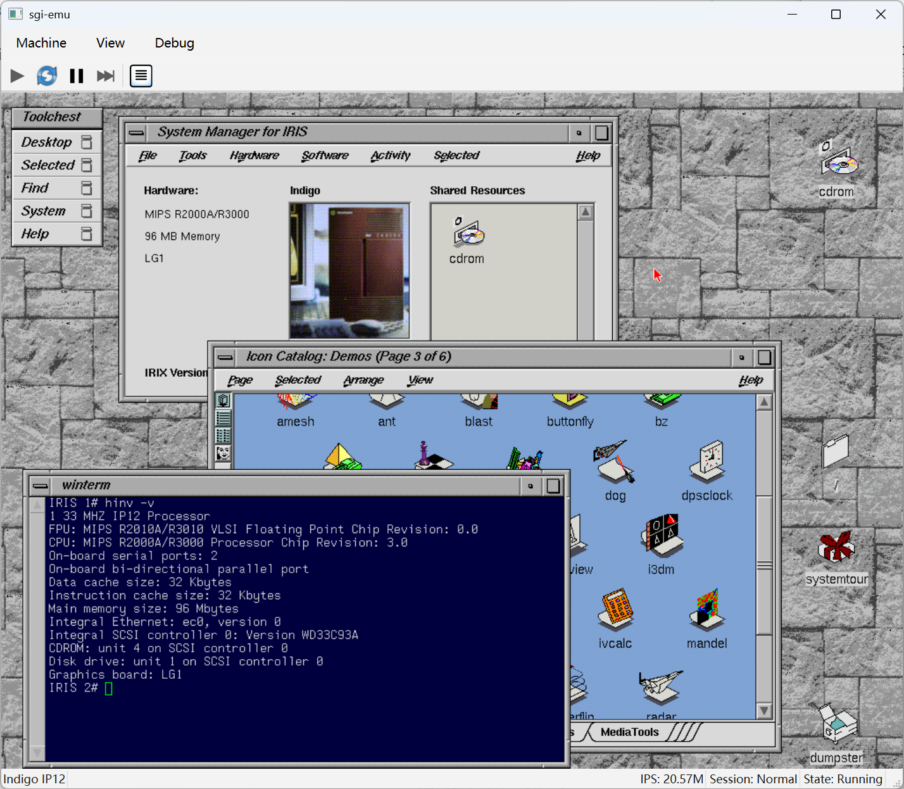

# sgi-emu

A work-in-progress emulator for Silicon Graphics workstations.

The project is currently focused on the original **SGI Indigo (IP12)** with a 33 MHz MIPS R3000A processor. It can currently boot **IRIX 5.3** into the Indigo Magic desktop, as well as boot NetBSD/sgimips.

> [!IMPORTANT]
> sgi-emu is under active development. Many hardware behaviors are still incomplete or under active validation.

<p align="center">
  
</p>

<p align="center">
  <em>IRIX 5.3 running on the emulated Indigo IP12 with LG1 graphics.</em>
</p>

## Current status

### Software

| Software               | Status                            |
| ---------------------- | --------------------------------- |
| Indigo IP12 PROM       | Boots and enters the PROM monitor |
| IRIX 5.3               | Boots to the Indigo Magic desktop |
| NetBSD/sgimips 11.99.8 | Installs and boots to multi-user  |

### Hardware

| Hardware         | Status          |
| ---------------- | --------------- |
| CPU              | Usable          |
| PIC1             | Usable          |
| HPC1             | Usable          |
| INT2             | Usable          |
| SCSI Controller  | Usable          |
| SCSI Disk/CD-ROM | Partial         |
| Ethernet         | Usable          |
| Audio            | Not implemented |
| Graphics         | Partial         |

## Emulation philosophy

sgi-emu focuses on reproducing **software-visible hardware behavior**.

The goal is not to reproduce every internal pipeline, arbitration mechanism, or silicon implementation detail unless software can observe the difference.

In short:

> **Emulate observables, not mechanisms.**

Timing is modeled when it is architecturally or software-visible, such as timers, interrupts, timeouts, DMA completion, or required busy states.

The global scheduler models time and externally observable events rather than device implementation details.

## Machines

| Machine        | Platform | Status                 |
| -------------- | -------- | ---------------------- |
| Indigo (R3000) | IP12     | Active development     |
| Indigo (R4000) | IP20     | Possible future target |
| Indy           | IP24     | Possible future target |
| Indigo2        | IP22     | Possible future target |
| O2             | IP32     | Possible future target |

## Accuracy and validation

Hardware behavior is validated using a combination of:

- SGI hardware and software documentation
- original PROM behavior
- IRIX software behavior and available diagnostics
- available hardware specifications
- open-source operating system drivers
- independent emulator/reference implementations where useful

Other emulator implementations are treated as references, not as hardware specifications.

When documentation and existing implementations disagree, preference is given to reproducible behavior and primary sources.

## Getting started

### Requirements

- Rust 1.95 or newer
- Qt 6 (Core, Gui, and Widgets)
- A C++17-capable compiler
- Git
- A C11-capable compiler, Python 3, Meson 1.4 or newer, and Ninja

The Qt build must provide `qmake6` or `qmake`. If it is not available in `PATH`, set one of the following environment variables:

- `QMAKE` — path to the Qt 6 qmake executable
- `QT_DIR` — path to the Qt installation
- `QT_ROOT_DIR` — path to the Qt installation

### Building

```bash
git clone --recursive https://github.com/rickgcn/sgi-emu.git
cd sgi-emu
cargo build --release
```

### Running

```bash
cargo run --release -p se_app --bin sgi-emu
```

## AI-assisted development

Coding agents and language models are used extensively during development.

They are tools for implementation, source discovery, testing, and code review; hardware behavior is not considered correct solely because an AI generated or suggested it.

The project maintainer remains responsible for architectural decisions, hardware modeling, validation, and the resulting code.

## Firmware and software

sgi-emu does not distribute IRIX installation media.

Original SGI firmware may be required for some machines. Users are responsible for obtaining firmware and operating-system media appropriate for their system and jurisdiction.

## License

sgi-emu is licensed under the GNU General Public License v3.0. See [LICENSE](LICENSE) for details.
