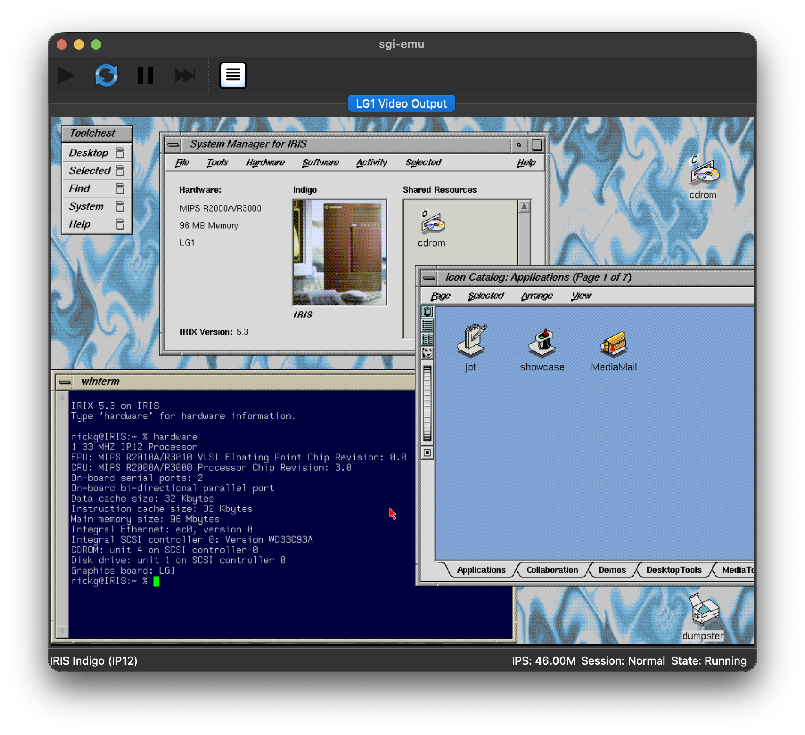
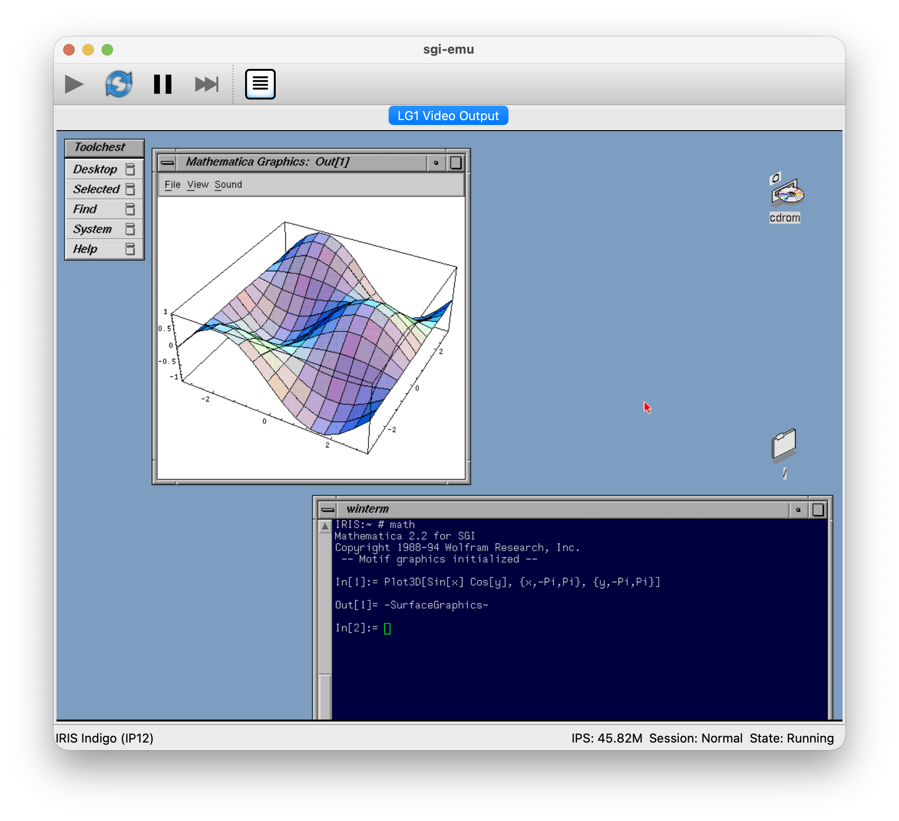
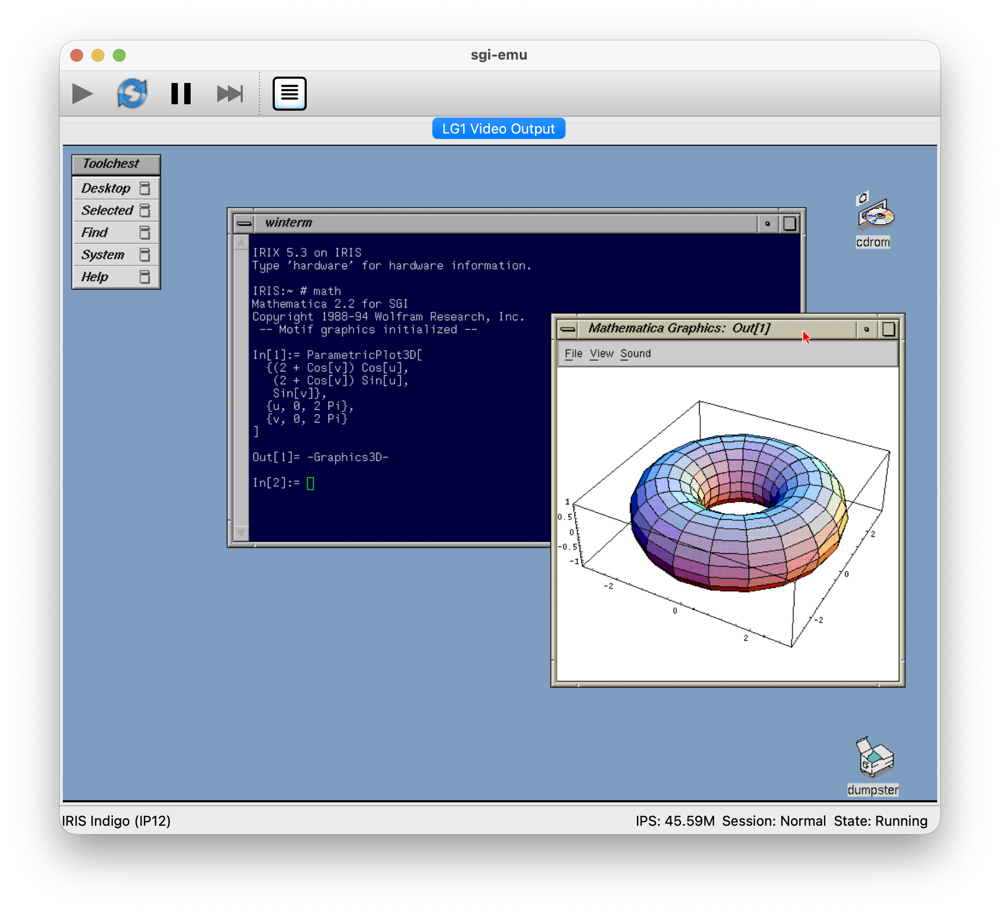
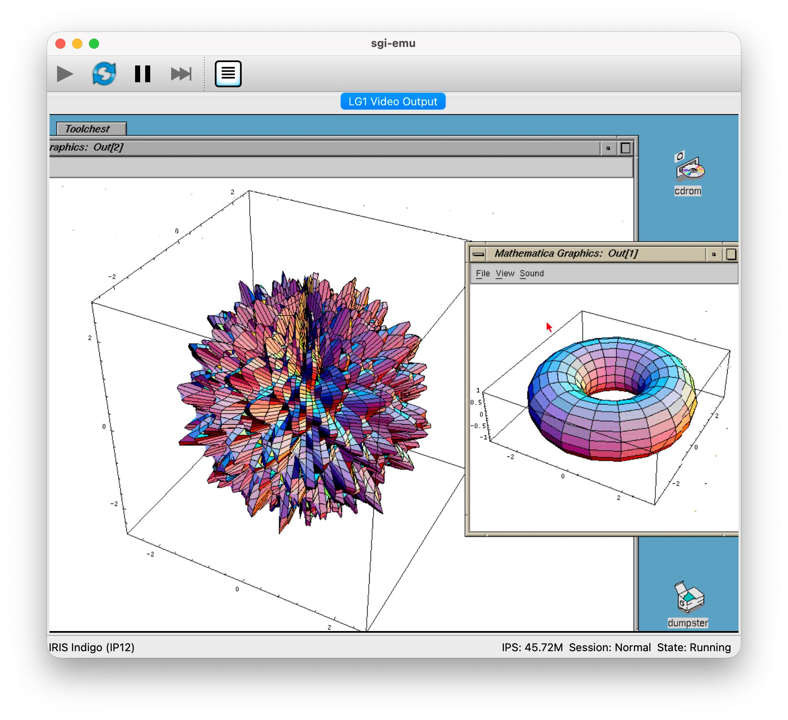
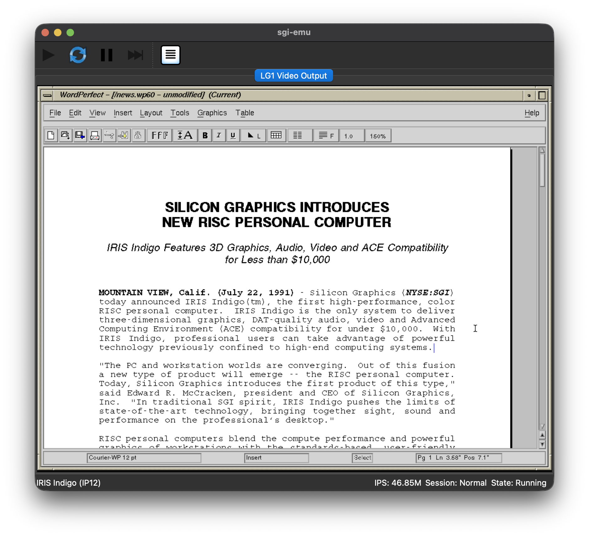
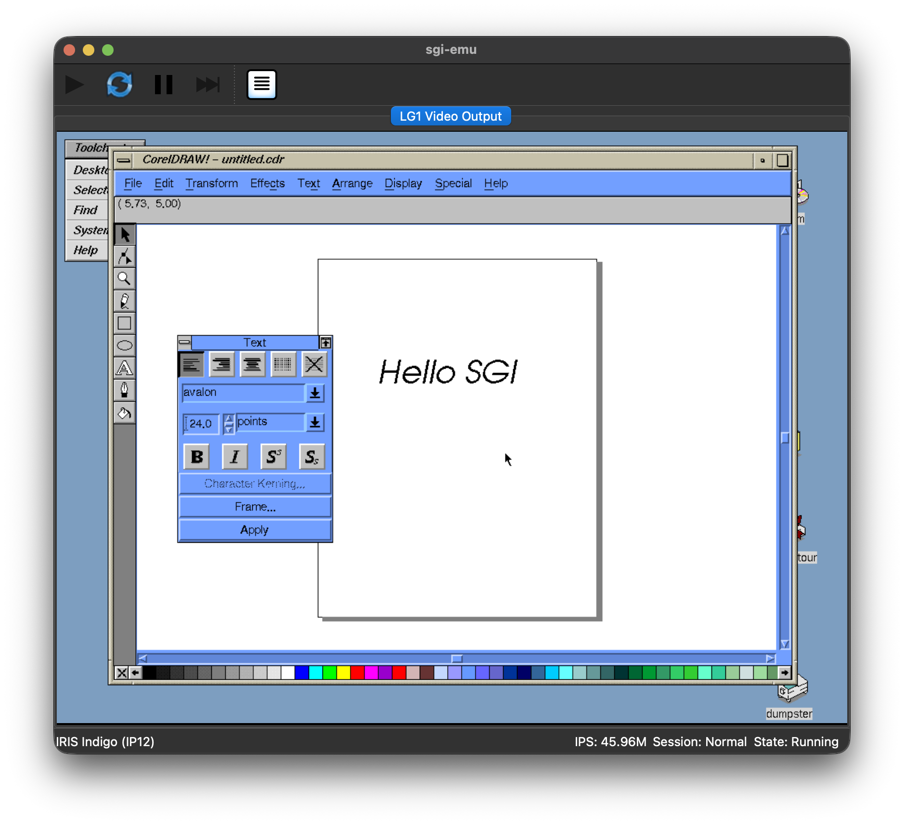

# sgi-emu

A work-in-progress emulator for Silicon Graphics workstations.

The project is currently focused on the original **IRIS Indigo (IP12)** with a 33 MHz MIPS R3000A processor. It can currently boot **IRIX 5.3** into the Indigo Magic desktop, as well as boot NetBSD/sgimips.

> [!IMPORTANT]
> sgi-emu is under active development. Many hardware behaviors are still incomplete or under active validation.

## Current status

### Software

| Software               | Status                            |
| ---------------------- | --------------------------------- |
| Indigo IP12 PROM       | Boots and enters the PROM monitor |
| IRIX 5.3               | Boots to the Indigo Magic desktop |
| NetBSD/sgimips 11.99.8 | Installs and boots to multi-user  |

### Hardware

| Hardware         | Status          |
| ---------------- | --------------- |
| CPU              | Usable          |
| PIC1             | Usable          |
| HPC1             | Usable          |
| INT2             | Usable          |
| SCSI Controller  | Usable          |
| SCSI Disk/CD-ROM | Partial         |
| Ethernet         | Usable          |
| Audio            | Not implemented |
| Graphics         | Partial         |

## Emulation philosophy

sgi-emu focuses on reproducing **software-visible hardware behavior**.

The goal is not to reproduce every internal pipeline, arbitration mechanism, or silicon implementation detail unless software can observe the difference.

In short:

> **Emulate observables, not mechanisms.**

## Machines

| Machine        | Platform | Status                 |
| -------------- | -------- | ---------------------- |
| Indigo (R3000) | IP12     | Active development     |
| Indigo (R4000) | IP20     | Possible future target |
| Indy           | IP24     | Possible future target |
| Indigo2        | IP22     | Possible future target |
| O2             | IP32     | Possible future target |

## Accuracy and validation

Hardware behavior is validated using a combination of:

- SGI hardware and software documentation
- original PROM behavior
- IRIX software behavior and available diagnostics
- available hardware specifications
- open-source operating system drivers
- independent emulator/reference implementations where useful

Other emulator implementations are treated as references, not as hardware specifications.

When documentation and existing implementations disagree, preference is given to reproducible behavior and primary sources.

## Building

sgi-emu requires Rust 1.95+, Qt 6 (Core, Gui, Widgets), Git, and a C++17-capable compiler.
The bundled native dependencies also require Python 3, Meson 1.4+, Ninja, and a C11-capable compiler.

On Linux, additional Wayland/X11 development packages and matching QtGui private headers are required.

```bash
git clone --recursive https://github.com/rickgcn/sgi-emu.git
cd sgi-emu
cargo build --release
```

Run the emulator with:

```bash
cargo run --release -p se_app --bin sgi-emu
```

Qt must provide `qmake6` or `qmake`. If it is not in `PATH`, set `QMAKE`, `QT_DIR`, or `QT_ROOT_DIR` to the appropriate Qt installation.

## AI-assisted development

Coding agents and language models are used extensively during development.

They are tools for implementation, source discovery, testing, and code review; hardware behavior is not considered correct solely because an AI generated or suggested it.

The project maintainer remains responsible for architectural decisions, hardware modeling, validation, and the resulting code.

## Firmware and software

sgi-emu does not distribute IRIX installation media.

Original SGI firmware may be required for some machines. Users are responsible for obtaining firmware and operating-system media appropriate for their system and jurisdiction.

## License

sgi-emu is licensed under the GNU General Public License v3.0. See [LICENSE](LICENSE) for details.

## Gallery

Original IRIX software running on an emulated 33 MHz R3000 Indigo.

<table>
  <tr>
    <td width="50%" valign="top">
      <a href="assets/gallery/irix-5.3-desktop.png">
        
      </a>
      <br>
      <strong>IRIX 5.3 Desktop</strong>
      <br>
      <sub>
        The Indigo Magic desktop running on an emulated 33 MHz R3000 Indigo.
      </sub>
    </td>
    <td width="50%" valign="top">
      <a href="assets/gallery/mathematica-2.2-plot3d-surface.png">
        
      </a>
      <br>
      <strong>Mathematica 2.2 — Plot3D</strong>
      <br>
      <sub>
        A 3D surface rendered through Mathematica's Motif graphics frontend.
      </sub>
    </td>
  </tr>
  <tr>
    <td width="50%" valign="top">
      <a href="assets/gallery/mathematica-2.2-parametric-torus.png">
        
      </a>
      <br>
      <strong>Mathematica 2.2 — ParametricPlot3D</strong>
      <br>
      <sub>
        A parametric torus rendered natively on the emulated Indigo.
      </sub>
    </td>
    <td width="50%" valign="top">
      <a href="assets/gallery/mathematica-2.2-complex-3d-spiky-surface.png">
        
      </a>
      <br>
      <strong>Mathematica 2.2 — Scientific Visualization</strong>
      <br>
      <sub>
        A heavier 3D workload exercising the R3000, FPU, X11, and graphics subsystem.
      </sub>
    </td>
  </tr>
  <tr>
    <td width="50%" valign="top">
      <a href="assets/gallery/wordperfect-6.0-indigo-press-release.png">
        
      </a>
      <br>
      <strong>WordPerfect 6.0</strong>
      <br>
      <sub>
        Editing and formatting SGI's original 1991 IRIS Indigo press release.
      </sub>
    </td>
    <td width="50%" valign="top">
      <a href="assets/gallery/coreldraw-3.5-hello-sgi.png">
        
      </a>
      <br>
      <strong>CorelDRAW 3.5</strong>
      <br>
      <sub>
        CorelDRAW for UNIX running natively on IRIX 5.3 with vector text and graphics editing.
      </sub>
    </td>
  </tr>
</table>